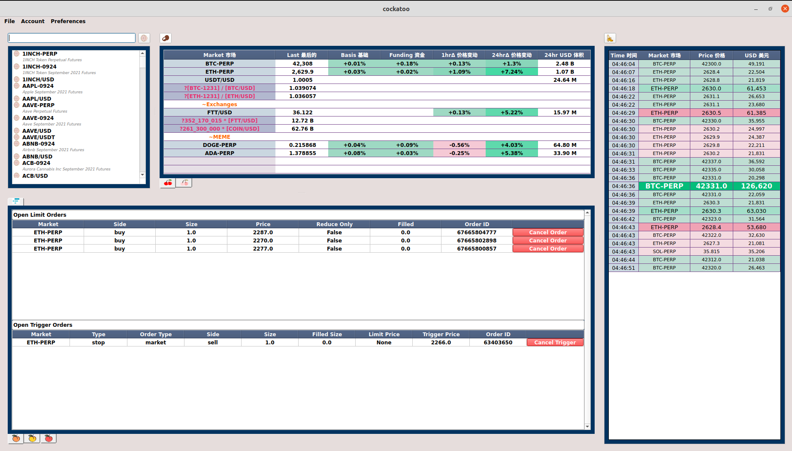
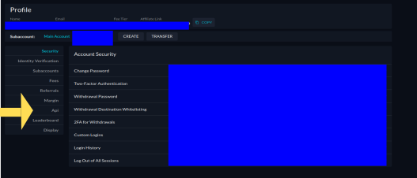
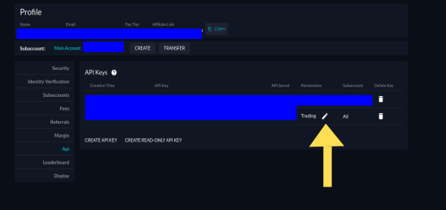
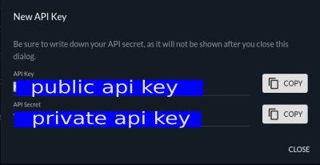
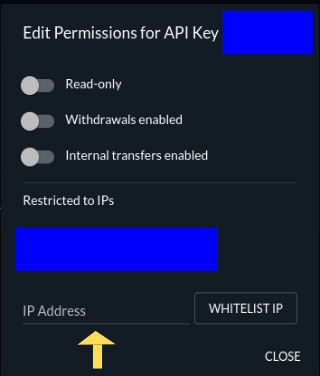
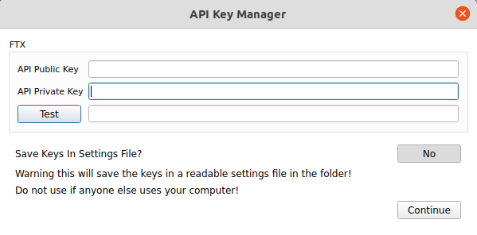
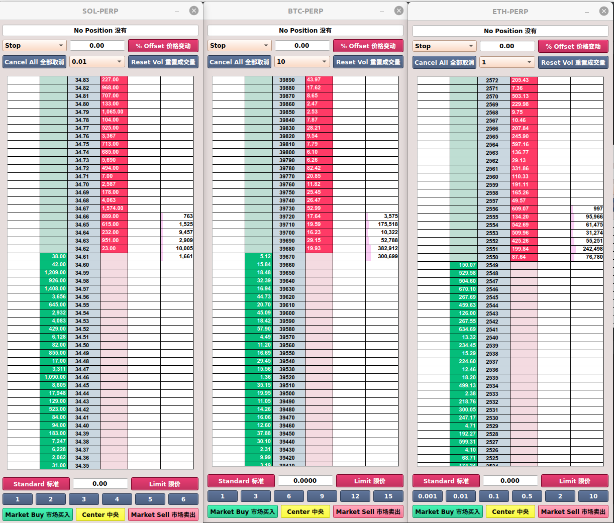
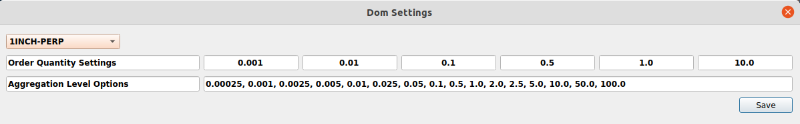

 

Welcome to open source trading platform for use with FTX exchange international (FTX US is on the TODO list)

If you have any questions, comments, setup problems then reach out @cockatoo_scoops on twitter

## Setup
1. Install python3 -https://www.python.org/downloads
2. Clone the git repository into a folder
3. Open command line, navigate to the git folder and install the requirements.*
	- pip3 install -r requirements.txt
4. Run main.py
	- python3 main.py
	
*Optional. Create your own python environment within your git folder and install the requirements
- python3 -m venv INSERT_YOUR_PATH_HERE
- [linux] source INSERT_YOUR_PATH_HERE/venv/bin/activate
- [windows] INSERT_YOUR_PATH_HERE/venv/Scripts/activate.bat
- pip3 install -r requirements.txt

## Sign up to FTX exchange
[ftx.com](https://ftx.com/#a=cockatoo)

## Features

### Main Window
 

Create your api public and private key details from https://ftx.com/profile.

 

 

 

 

 

Make sure you whitelist your IP address for security. This means only request orders coming from your IP will be allowed.

 

Input your api keys by going to the menu section -> account ->  API Keys

 

You can elect to either save your keys in the settings file (not encrypted), or have the program forget them on exit. The default is to not save them. It is advised to not save them if anyone else uses your computer.

NEVER SHARE YOUR KEYS WITH ANYONE ELSE.

Click on test connection to see if you have inputed the keys correctly.

#### Market Explorer
 - In the top left you can search for all the available markets on FTX. 
 - Add any favourites by clicking on the orange icon next to the contract name.
 - Filter the list by clickon on the orange button
 - Double click on contract name to launch a depth of market window (see below)
 
#### Quoteboard
There are two tabs in the quote board section.
1. The first tab contains the user short listed markets. User can change the markets by double click in the market column cell and either
	- Entering in contract name. Eg: BTC-PERP
	- Entering in special formula. This has to use first character as **?** followed by the formula. Contracts in the formula need to be surrounded by square brackets.
	- Entering in a heading line. This has to use first character as **~**
	- There are User can modify which markets they want to short list by double clicking on a cell in the market column and entering in the contract name.
	- The right click on button above the quoteboard will remove a selected row. Left click will insert a row a selection position.
2. The second tab contains summary of all markets trading on FTX. Columns are sortable by column values.

#### Trade Section
Notable trades are displayed here. Select which markets you want to monitor but clicking on the button above the trade section and clicking the icon next to the contract name (similar to saving favourites in the market explorer).

Currently the settings are hard coded to only include trades above 20k USD. The trades are then styled differently for 25k - 50k, 50k - 100k, 100K - 200k, > 200k and trade liquidation. I will generalise this in the future and allow the user to customise these settings.

#### Accounts Section
This contains 3 tabs.
1. Open order information
2. Open position information
3. Account balance information

### Depth of Market Window (DOM)
 

Settings for the dom window are contained in the main window menu bar -> preferences -> dom settings

Here you can control the order button values and specify the tick size aggregation levels you want to use. Enter in aggregation levels with a **,** seperator. These settings can be specified at market level.

 

The DOM window has 6 components
1. Open position status in the top row. Can either be No position, long, short for a given market. 
	- The spot contracts are treated differently. Position is displayed as [free spot position | total spot position]
	- for example if you have 100 $FTT in your account but only 20 of them are staked this would display as [80 | 100]
2. The second row contains settings for conditional orders. 
	 - The conditional order types are Stop, Take Profit and Trailing Stop. The dropdown on the left side specifies which conditional order you want to use. Usage in placing orders section below.
	 - The middle quantity box details the trailing stop offset you want to have. If this box is 0 then 
	 - The right switch button can either be percent offset or tick size offset for the trailing stop offset.
	 - Note the conditional orders are not available for spot positions
3. The third row contains cancel all orders button, tick aggregation level, and reset volume profile button.
	- The cancel all orders will only cancel orders for the contract on that specific DOM ladders
	- Tick aggregation level controls the tick size you see in the market table. Eg: if we have ETH-PERP open and tick aggregation of 1 the price increments will be $1. Changing this will redraw the table to your chosen tick size. The tick size defaults to open around 0.05% which approximately matches the percentage fee on a trade.
4. The main price table contains 6 columns.
	- The 1st and 5th column will show the orders you have on the bids and offers respectively.
	- The 2nd and 4th column show the bids and offers.
	- The 3rd column shows the price
	- The 6th column shows the volume profile for trades since you have opened the window. When you change the tick aggregation level from 2. the volume profile will aggregate to that new value.
5. The 5th section contains 
 - Standard order or reduce only option, if reduce only is selected you will only be able to exit a position.
 - Order quantity box. This is set in 6.
 - Limit or post only option, if post only is selected any orders which cross the spread will be rejected.
6. Order button values. Right click on these buttons will increment the order box quantity by the button value. Left click will reduce. The last button you have clicked will let you use mouse wheel on the order quantity box.
7. Market buy, center and market cell buttons.
	- Market buy/sell will market buy/sell the value you have in the order quantity box. 
	- Center will reposition the market so it is centered on your screen. Spacebar and wheel mouse click will center all open ladders
	
#### Order placing
To place a buy order you will first need a non zero quantity in the order box. Then in the main price table you will click on the price you want to buy in the second column. You can place buy orders above the best ask price to cross the spread.
A sell order works the same way except you need to enter it on the 4th column.

To place a conditional order you first select the conditional order type from section 2. then select the price in the 3rd column and drag to either the 2nd column for a buy order or the 4th column for a sell order.

If you have placed an order successfully you will the order display in the 1st or 5th column.

To cancel an order you left click on the order on the DOM ladder.

## TODO list
1. Cumulative trade delta (total buys - total sells) and total liquidations statistics
2. Synthetic markets, autospreading for PERP vs PERP trades
3. Different themes 
4. FTX US

